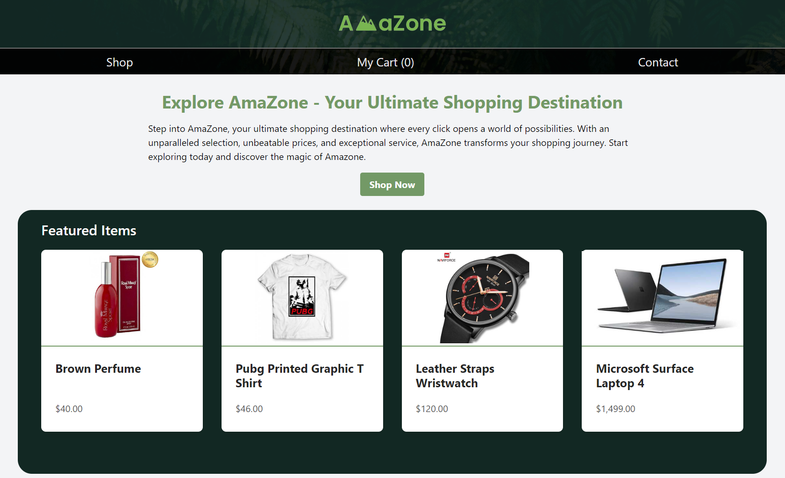

# Ecommerce Shopping Cart 🛒

Welcome to the Ecommerce Shopping Cart project! This application utilises a fake store API from [DummyJSON](https://dummyjson.com/) to create a simulated online shopping experience. 

## Technologies Used

- **React**: A powerful JavaScript library for building user interfaces.
- **TypeScript**: The statically typed superset of JavaScript for enhanced code quality and developer productivity.
- **Tailwind CSS**: A utility-first CSS framework for quickly building custom designs.

## Learning Highlights

Developing the Ecommerce Shopping Cart project has been an enriching learning experience, offering insights into various aspects of web development:

- **TypeScript Adoption:** Embracing TypeScript enhanced the development process by catching errors early and providing better code documentation and editor support.

- **Tailwind CSS Mastery:** Leveraging Tailwind CSS facilitated rapid UI development with its utility-first approach, resulting in a clean and consistent design.

- **React Router Implementation:** Integrating React Router enabled seamless navigation between different sections of the application, enhancing user experience and engagement.

- **React Loader Utilization:** Incorporating React Loader enhanced the application's responsiveness by providing visual feedback during data fetching, improving overall usability.

- **React Context for State Management:** Utilizing React Context simplified state management across components, ensuring a scalable and maintainable codebase.

- **Responsive Design Principles:** Implementing responsive design principles ensured optimal user experience across various devices and screen sizes, catering to a wider audience.

This project has not only improved technical skills but also fostered a deeper understanding of user-centric design, project organization, and application scalability. We look forward to further enhancing and expanding this project in the future.

## To Do

- Integrate icons to enhance visual clarity and user experience.

- Add filter funcionality with search bar and category dropdown

## How to Use

1. **Clone the repo:**  
   `git clone https://github.com/tono0682/shopping-cart.git`

2. **Once you have cloned this project, you can install the required dependencies by using:**
   `npm install`

3. **View live demp of project:**
   `npm run preview`

4. **Produce distribution files:**
   `npm run build`